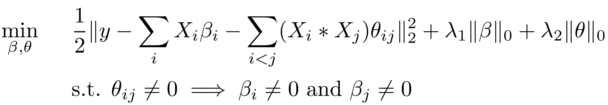

# hierScale
### Hussein Hazimeh and Rahul Mazumder
### Massachusetts Institute of Technology

## Introduction
hierScale is scalable toolkit for fitting sparse linear regression models with pairwise feature interactions. The optimization is done under the **strong hierarchy (SH)** constraint: an interaction coefficient is non-zero only if its associated main feature coefficients are non-zero. This constraint can enhance the interpretability of sparse interaction models and also reduce the future data collection costs; see the discussion in [(Hazimeh and Mazumder, 2020)](https://arxiv.org/abs/1902.01542).

More formally, given a data matrix X of main features and a response vector y, the toolkit fits a **convex relaxation** of the following model:



 where X_i denotes the ith column (feature) of X and * refers to element-wise multiplication. The L0 norms impose sparsity on the coefficients and the constraints enforce SH. See [(Hazimeh and Mazumder, 2020)](https://arxiv.org/abs/1902.01542) for details on how the convex relaxation of the above problem is derived. The optimization is done for a regularization path (i.e., over a grid of lambda_1's and lambda_2's). We use proximal gradient descent (PGD) for optimization, along with novel proximal screening and gradient screening rules, which speed up PGD by over 4900x.

## Installation
hierScale is written in Python 3. It uses Gurobi internally (for solving the LPs required for checking the optimality conditions). Before installing hierScale, please make sure that  [Gurobi](https://www.gurobi.com) and its Python interface (gurobipy) are installed.

To install hierScale, run the following command:
```bash
pip install hierScale
```

## Quick Start
In Python, assuming you have the data X and y stored as numpy arrays, run the following to fit a regularization path:
```python
from hierScale import hier_fit, hier_predict

# Set the parameters of the algorithm.
params = {
    "nLambda": 100, # Number of lambda_1's in the path.
    "maxSuppSize": 500, # Max support size to terminate the path at.
}

# Fit a path.
solutions, lambdas = hier_fit(X, y, params)

# solutions is a list of all the solutions in the path.
# To access the ith solution, say i=10, use the following:
current_solution = solutions[10]
current_solution.B # A dictionary of the non-zero coefficients in beta.
current_solution.T # A dictionary of the non-zero coefficients in theta.
current_solution.intercept # The intercept term.

# To predict the response given a matrix X, run the following:
hier_predict(current_solution, X)

# For more advanced usage and parameters, please check the documentation:
print(hier_fit.__doc__)
```


## References
[Learning Hierarchical Interactions at Scale: A Convex Optimization Approach](https://arxiv.org/abs/1902.01542).

Bibtex citation below:
```
@inproceedings{hazimeh_mazumder_2020,
  author    = {Hussein Hazimeh and
               Rahul Mazumder},
  title     = {Learning Hierarchical Interactions at Scale: A Convex Optimization Approach},
  booktitle = {The 23nd International Conference on Artificial Intelligence and Statistics,
               {AISTATS} 2020, 3-5 June 2020, Palermo, Sicily, Italy},
  series    = {Proceedings of Machine Learning Research},
  volume    = {108},
  publisher = {{PMLR}},
  year      = {2020},
  url       = {https://arxiv.org/abs/1902.01542},
}
```
